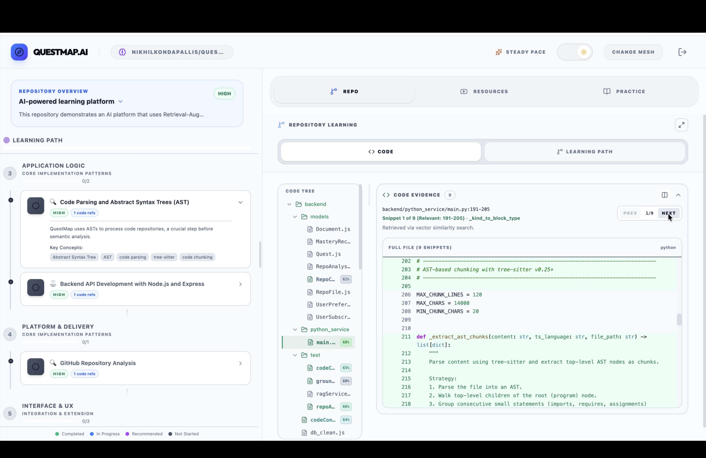
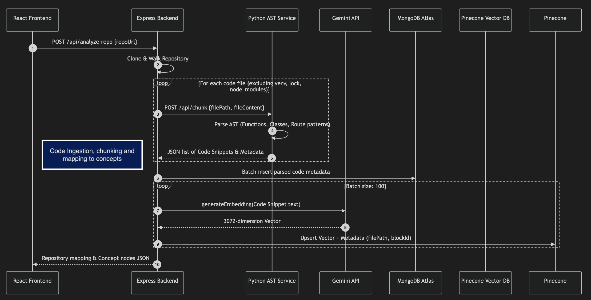
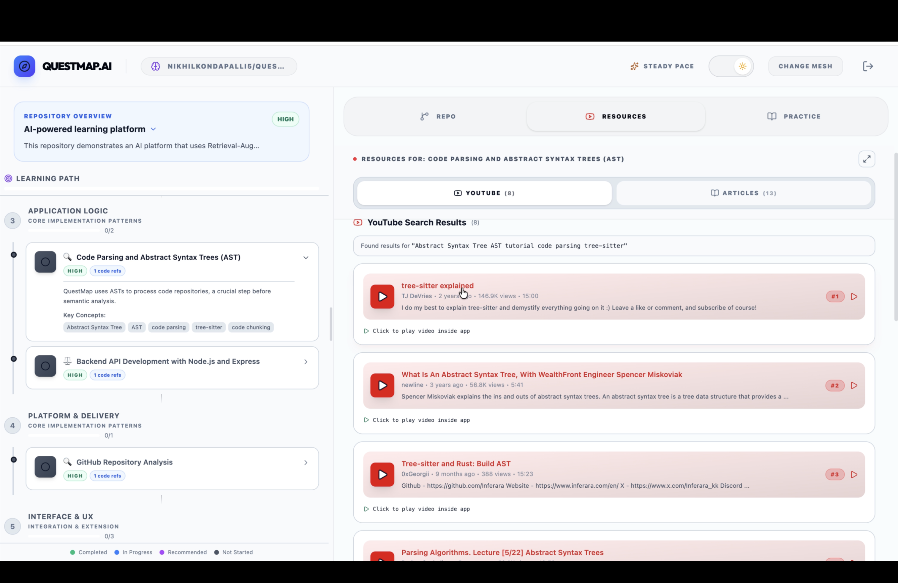
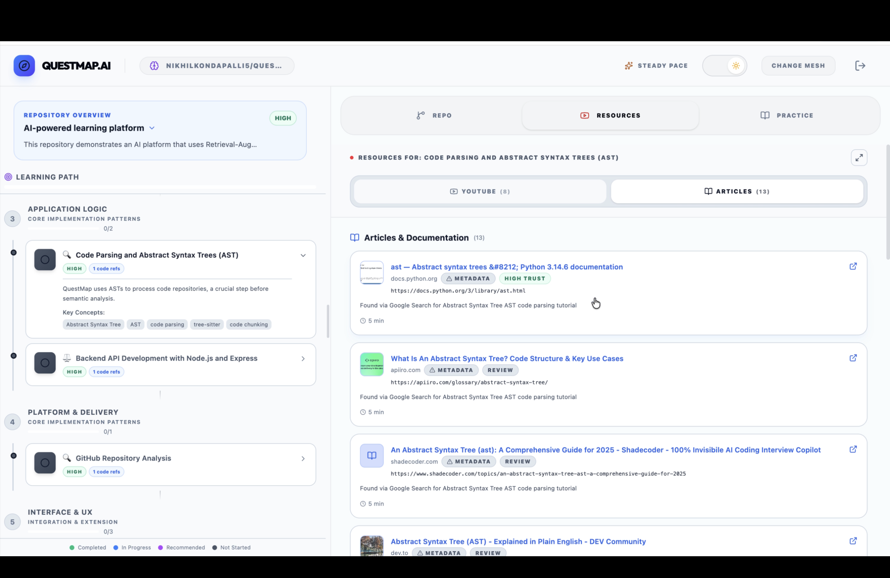

# 🗺️ QuestMap AI: RAG-Powered Personalized Learning & Code Explorer

QuestMap is an educational platform that transforms source documents and code repositories into interactive, personalized learning journeys. By leveraging **Retrieval-Augmented Generation (RAG)**, QuestMap grounds its AI tutor in your specific source materials to align the learning path, practice quizzes, and recommended resources with your curriculum or codebase.



## 🚀 Key Features

### 🧠 Adaptive Knowledge Maps
Visualize your learning journey. QuestMap processes your goals, background, and uploaded documents to generate a structured, interactive map of sub-topics.

### 💻 GitHub Repository Code Explorer
Analyze code repositories. QuestMap parses your codebase, generates abstract syntax tree (AST) code chunks, indexes them semantically in Pinecone, and maps files to conceptual learning nodes. Users can explore a custom, interactive IDE-like flat file tree, highlight matching line ranges, navigate snippets with previous/next buttons, and resize the code editor window dynamically.

### 📺 Contextual Resource Curation for Code
QuestMap automatically curates external learning resources—such as relevant YouTube video walkthroughs and technical articles—that map directly to the active code snippets or repository concept nodes you are currently exploring.

### 📚 Strict RAG Grounding
QuestMap uses Retrieval-Augmented Generation (RAG) to ground practice questions and recommendations in the concepts found in your uploaded PDFs, notes, and code.

### 🛡️ RAG Relevance Guard & Code Threshold
QuestMap applies a semantic threshold filter and exclusions for virtual environments (`venv`, `.venv`) or configuration files to maintain relevance between document context and the active learning quest.


---

## 🛠️ Tech Stack

**Frontend:**
- **React (Vite)**: Web frontend framework.
- **Framer Motion**: For fluid animations and transitions.
- **Lucide Icons**: For a modern, clean design system.
- **Tailwind CSS**: For responsive and sleek styling.

**Backend:**
- **Node.js & Express**: API web server layer.
- **Python AST Service**: FastAPI service utilizing `tree-sitter` for syntactic code chunking.
- **Pinecone Vector DB**: Vector database for RAG retrieval and semantic code searches.
- **Google Gemini 2.5 / 2.0 / 1.5 Flash**: Language models used for generating knowledge maps, query expansions, and grounding.
- **MongoDB Atlas**: Persistent storage for user profiles, files, and quest history.

---

## 🏗️ Architecture: The RAG & Code Ingestion Pipeline

### 📄 Document Ingestion
1. **Ingestion & Parsing**: Uploaded PDF, DOCX, and TXT files are extracted, cleaned, and split into paragraph-based text chunks.
2. **Text Embeddings**: Chunks are mapped to 768-dimensional vectors using `gemini-embedding-001` and indexed under the default namespace in Pinecone.

### 💻 Repository & Codebase Learning Architecture
1. **Directory Tree Traversal**: The repository analyzer scans the directory recursively, filtering out configuration metadata and virtual directories (e.g., `.git`, `node_modules`, `.venv`, `dist`, `build`) to compile a clean, flat-file tree structure.
2. **Syntax-Aware AST Chunking**: Code files are sent to the Python microservice, which utilizes `tree-sitter` parsers. The service breaks source files down along strict AST syntactic boundaries (functions, classes, methods, handlers) instead of raw line numbers, keeping scope and decorators intact.

   
3. **LLM-Driven Concept Generation**: The codebase structure, metadata imports, AST code clusters, and the target repository's README file are compiled into an evidence catalog. This catalog is processed by Google Gemini to identify 8-10 core reusable programming concepts, sequence them logically based on learning difficulty, and format them into a structured DAG knowledge map for the dashboard.
4. **Semantic Vector Mapping**: Extracted AST chunks are embedded via `gemini-embedding-001` and stored in a repository-specific Pinecone namespace.
5. **Query Expansion & Linking**: Concept terms in the learning path undergo Gemini-driven expansion. The system queries Pinecone using a similarity filter (`0.6` cosine threshold) to map conceptual nodes on the map directly to matching file ranges and functions in the repo.
6. **Interactive Repository Explorer**: The client React interface renders the codebase flat-file tree dynamically, highlight ranges in an integrated editor with line scroll-centering, maps interactive search keywords, provides controls for code explanation chats with context continuation, and supports resizable workspace panels.

---

## 📂 Project Structure

```text
├── backend/                  # Express server & RAG services
│   ├── server.js             # Main API entry point & search routes
│   ├── ragService.js         # Pinecone & Embedding logic
│   ├── codeConceptService.js # Code semantic linkage & query expansion
│   ├── repoAnalyzerService.js# Repository directory structure analyzer
│   ├── fileParser.js         # PDF/Docx text extraction
│   ├── python_service/       # Python AST tree-sitter chunker service
│   │   ├── main.py           # FastAPI entrypoint
│   │   ├── setup.sh          # Virtual environment builder script
│   │   └── requirements.txt  # Python package requirements
│   └── models/               # Mongoose schemas
├── frontend/                 # React application
│   ├── src/pages/            # Dashboard, LevelQuiz, and Profile views
│   ├── src/components/       # RepoLearningPanel, ResourcePanel, and Maps
│   └── src/lib/              # API and Auth utilities
```

---

## ⚙️ Setup & Installation

### Prerequisites
- Node.js (v18+)
- Python (v3.9+)
- MongoDB Atlas account
- Pinecone account & API Key
- Google AI (Gemini) API Key

### Installation

1.  **Clone the Repository**
    ```bash
    git clone https://github.com/nikhilkondapalli5/QuestMap.git
    cd QuestMap
    ```

2.  **Backend & Python Service Setup**
    ```bash
    cd backend
    npm install
    
    # Set up and activate the Python AST chunker virtual environment
    cd python_service
    chmod +x setup.sh
    ./setup.sh
    
    # Create a .env file in the backend/ folder with your API keys
    # See backend/.env.example for required keys (GEMINI_API_KEY, PINECONE_API_KEY, MONGO_URI)
    ```

3.  **Running the Dev Environment**
    - To run both Node.js API and Python Chunker concurrently:
      ```bash
      # From the backend directory
      npm run dev:all
      ```
    - Or run them individually:
      ```bash
      # Tab 1: Node.js
      npm run dev
      
      # Tab 2: Python Chunker
      npm run dev:python
      ```

4.  **Frontend Setup**
    ```bash
    cd ../frontend
    npm install
    npm run dev
    ```

---

## 📺 Demo Snapshots

| **GitHub Repository Analysis View** |  |
| **Personalized Quest Dashboard** |  |
| **AI Explain & Chat Panel** |  |
| **YouTube Resources Discovery Tab** |  |
| **Articles & Documentation Curation Tab** |  |

---

## 📄 License

This project is licensed under the Apache License 2.0 - see the [LICENSE](LICENSE) file for details.
