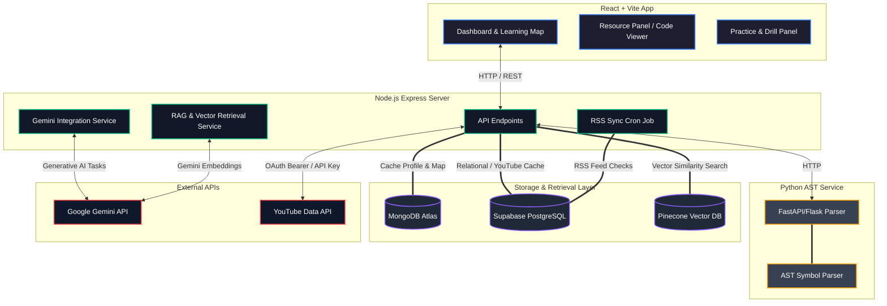
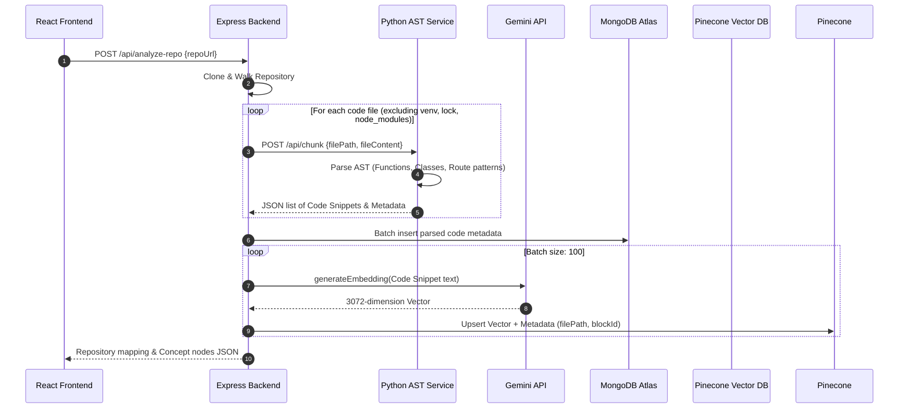
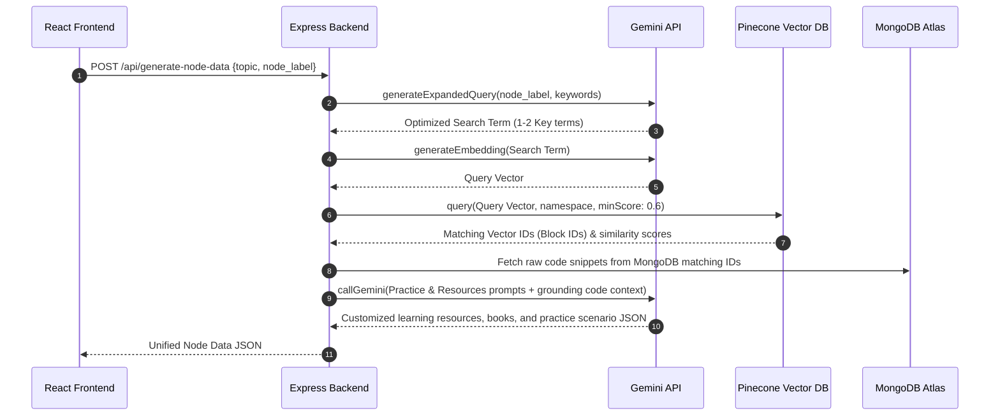

# QuestMap: System Architecture Diagram

This document contains a comprehensive system architecture description and interactive Mermaid diagrams representing the components and data flows of the **QuestMap** project. You can copy and paste the Mermaid code directly into your GitHub repository's `README.md` or wiki.

---

## 1. High-Level System Architecture

This diagram shows how the React frontend, Node.js backend, Python service, databases, and third-party APIs connect.



---

## 2. Key Data Flows

### A. Repository Scanning & Code Evidence Indexing

When a user links a GitHub repository, this flow runs to parse files, calculate embeddings, and index the codebase:



---

### B. Concept Generation & Vector Retrieval

When generating learning nodes and practice scenarios, this flow retrieves the relevant code snippets via semantic search:



---

### C. YouTube Discovery & Prioritization Flow

When recommendations are generated, this flow uses the user's OAuth token (or server fallback) to fetch and prioritize subscribed videos:

```mermaid
flowchart TD
    Start([Get YouTube Videos]) --> CheckToken{ytAccessToken provided?}
    
    %% Token Path
    CheckToken -- Yes --> FetchSubs[Fetch & cache user subscriptions in MongoDB]
    FetchSubs --> SearchAuth[Search YouTube API using token in 'Authorization: Bearer' header]
    
    %% Fallback Path
    CheckToken -- No --> CheckApiKey{process.env.YOUTUBE_API_KEY present?}
    CheckApiKey -- Yes --> SearchApiKey[Search YouTube API using 'key' parameter]
    CheckApiKey -- No --> NoVideos[Return empty list '[]']
    
    %% Merge & Prioritize
    SearchAuth --> FetchStats[Batch-fetch statistics views/durations]
    SearchApiKey --> FetchStats
    
    FetchStats --> MatchSubs[Match search items against user subscriptions cached in MongoDB]
    MatchSubs --> PriorityGroup[Group matched items into Subscribed vs Regular results]
    PriorityGroup --> LimitPerChannel[Limit to max 2 videos per channel]
    LimitPerChannel --> FinalMerge[Merge & place Subscribed Channel matches at top]
    FinalMerge --> End([Return prioritized resource recommendations])
    NoVideos --> End
```
